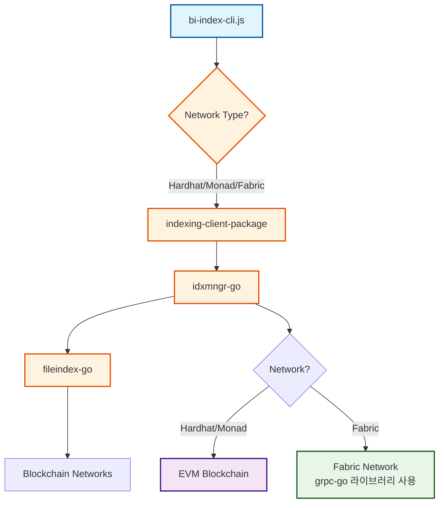

# 🚀 Fabric을 idxmngr에 통합하기

## 📋 **개요**

이 문서는 **Fabric 네트워크를 `idxmngr`을 통해 통합**하여 모든 네트워크가 동일한 경로로 작동하도록 하는 방법을 설명합니다.

## 🎯 **목표**

### **이전 구조 (문제점)**:
```
❌ Fabric insert: indexing-client-package → grpc-go/client (직접)
❌ Fabric verify: grpc-go/client (직접)
✅ EVM 계열: indexing-client-package → idxmngr (통합)
```

### **수정 후 구조 (목표)**:
```
✅ Fabric도: indexing-client-package → idxmngr (통합)
✅ 모든 네트워크: 동일한 경로로 통합
```

## 🔧 **수정된 파일들**

### **1. indexing-client-package/lib/indexing-client.js**
- ✅ Fabric 전용 클라이언트 제거
- ✅ 모든 네트워크가 `idxmngr`을 통해 통합
- ✅ 네트워크 정보를 포함한 데이터 전송

### **2. idxmngr-go/config/network_config.yaml**
- ✅ Fabric 전용 설정 추가
- ✅ 체인코드, 채널, 조직 정보 설정

### **3. idxmngr-go/manager/network_handlers.go**
- ✅ FabricHandler에 grpc-go 클라이언트 통합
- ✅ `executeGrpcGoCommand` 메서드 추가
- ✅ Fabric 체인코드 호출 로직 구현

### **4. idxmngr-go/manager/mserver.go**
- ✅ `InsertIndexRequest`에서 네트워크별 핸들러 사용
- ✅ Fabric 네트워크도 idxmngr을 통해 처리

### **5. contract/scripts/unified-index.js**
- ✅ 통합 테스트 스크립트 생성
- ✅ 모든 네트워크 테스트 가능

## 🏗️ **통합된 아키텍처**



## 🚀 **사용 방법**

### **1. 서버 시작**
```bash
cd bi-index/idxmngr-go
./idxmngr
```

### **2. 테스트 실행**
```bash
# 모든 네트워크 테스트
cd bi-index/contract/scripts
node unified-index.js

# 특정 네트워크만 테스트
node unified-index.js fabric
node unified-index.js hardhat
node unified-index.js monad
```

## 📊 **장점**

### **1. 통합된 아키텍처**
- ✅ **모든 네트워크**: 동일한 경로 (`indexing-client-package` → `idxmngr`)
- ✅ **일관된 인터페이스**: 네트워크별 차이 없음
- ✅ **중앙 집중식 관리**: `idxmngr`에서 모든 네트워크 처리

### **2. 유지보수성 향상**
- ✅ **단일 진입점**: `idxmngr`만 수정하면 모든 네트워크 반영
- ✅ **코드 중복 제거**: 네트워크별 분기 로직 통합
- ✅ **테스트 용이성**: 하나의 경로만 테스트

### **3. 확장성**
- ✅ **새 네트워크 추가**: `idxmngr`에만 로직 추가
- ✅ **프론트엔드**: 네트워크별 차이 없이 동일한 API 사용

## 🔍 **테스트 결과 예시**

```bash
🌟 === 통합 인덱스 테스트 시작 ===
📋 테스트할 네트워크: Hardhat, Monad, Fabric

🚀 === FABRIC 네트워크 테스트 시작 ===
📡 fabric 네트워크용 IndexingClient 생성 중...
🚀 fabric 네트워크에 데이터 삽입 중... (via idxmngr)
✅ fabric 데이터 삽입 결과: { ResponseCode: 200, ... }
🔍 fabric 네트워크 인덱스 정보 조회 중...
✅ fabric 인덱스 정보: { ... }
🔎 fabric 네트워크 데이터 검색 중...
✅ fabric 검색 결과: { ... }
🎉 fabric 네트워크 테스트 완료!

🎯 === 모든 네트워크 테스트 완료 ===
✅ 모든 네트워크가 idxmngr을 통해 통합 작동합니다!
```

## 🚨 **주의사항**

### **1. grpc-go 클라이언트 경로**
- FabricHandler에서 grpc-go 클라이언트 경로가 올바르게 설정되어야 함
- 상대 경로: `../grpc-go/client/client`

### **2. 네트워크 설정**
- `network_config.yaml`에서 Fabric 설정이 올바르게 되어야 함
- 체인코드, 채널, 조직 정보 확인

### **3. 서버 실행 순서**
1. `idxmngr-go` 서버 시작
2. `fileindex-go` 서버 시작 (필요시)
3. 테스트 스크립트 실행

## 🔮 **향후 개선사항**

### **1. 에러 처리 강화**
- 네트워크별 에러 메시지 표준화
- 재시도 로직 구현

### **2. 모니터링 추가**
- 네트워크별 성능 지표 수집
- 로그 분석 도구 통합

### **3. 설정 관리 개선**
- 환경변수 기반 설정
- 동적 설정 변경 지원

## 📞 **지원**

문제가 발생하거나 질문이 있으시면:
1. 로그 확인: `idxmngr.log`
2. 네트워크 설정 확인: `network_config.yaml`
3. 테스트 스크립트로 개별 네트워크 검증

---

**🎉 Fabric이 성공적으로 idxmngr에 통합되었습니다!**

